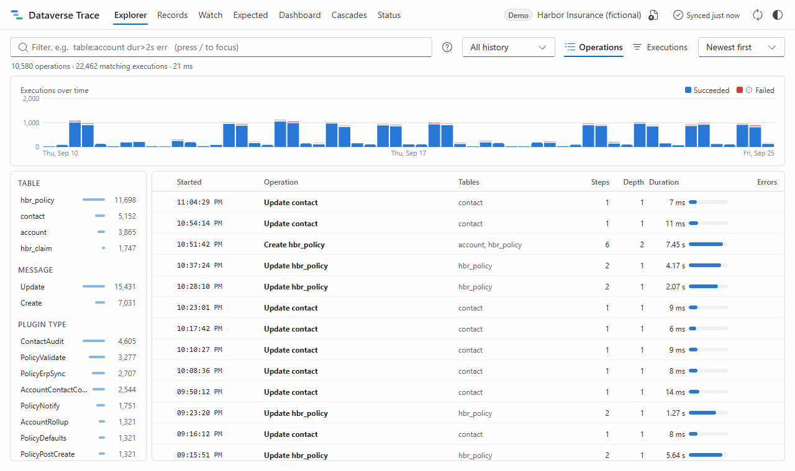

# Dataverse Trace

**See everything that ran when a Dataverse record was saved (plugins, system jobs, cloud flows and their nesting) on one timeline, with dashboards over weeks instead of the last 24 hours.**

It's a better Plugin Trace Viewer that runs **inside your environment** as a small solution of web resources. There's no server, no app registration and no Azure: it reads with the session you're already signed in with, and keeps its history in your browser.

**[Try the demo →](https://leduc212.github.io/dataverse-trace/)** (generated data for a fictional insurer; nothing to install)



> **Status: v0.2 ("the record story").** Explorer, timeline, dashboard, record story with cloud flows and audit, expected vs. actual, watch mode and shareable sessions work in the demo; testing in real environments is next. See the [roadmap](docs/PLAN.md#roadmap).

## What it does

- **Explorer:** every plug-in execution in local history, grouped into operations (one correlation ID each) or listed flat. A query language (`table:account dur>2s err "timeout"`), facets, a histogram, full-text search over trace text, and a detail panel with find-in-trace and parsed .NET exceptions.
- **Timeline:** a waterfall of one operation: the sync pipeline in stage and execution order, nested requests inside the step that caused them, and system jobs with their queue time. Links that can't be known exactly show a confidence; whole-second timestamps are shown as estimated, never faked.
- **Dashboard:** executions, error rate, sync p95, slowest steps, a day × hour heatmap, per-step statistics with trends, and findings such as *"Update step without filtering attributes runs 339 times a day"* or *"Depth 8 reached: possible loop"*.
- **Record story:** pick a record and see each save (from audit history: who, when, which columns) with everything it started: the plug-in pipeline, system jobs and **cloud flow runs**. Flow runs carry no record id, so those links are inferred from the flow's trigger (table, filtering columns, filter expression) and timing; each shows its confidence and the evidence behind it, and nothing inferred is drawn as exact.
- **Expected vs. actual:** everything registered to run for a table and change (plug-in steps in stage and order, classic workflows, business rules, cloud flows) with whether it should run for the changed columns, whether it did, and why not: *"filters on name, telephone1, but the save changed hbr_totalpremium"*.
- **Watch mode:** pick a record, press Watch, save it in the app, and the timeline fills in as rows arrive (at most 2 requests a second). System Administrators can switch plug-in tracing to *All* for the session: the app asks first and always puts the old value back.
- **Sharing:** copy any timeline as Markdown, or export it as a `.dvtrace.json` file, redacted by default (names, ids, host and trace text), that anyone can open read-only, including on the demo site.
- **Local history:** Dataverse deletes trace logs after about a day. The app syncs incrementally into IndexedDB, so trends cover weeks, and it marks the periods it couldn't collect.

## Install in an environment

1. Download a zip from the [latest release](https://github.com/leduc212/dataverse-trace/releases) (or build it; see below):
   - `DataverseTrace_x_y_z_managed.zip`: **managed**. Deleting the solution removes everything it added.
   - `DataverseTrace_x_y_z.zip`: unmanaged. Use this one to upgrade an unmanaged install, since Dataverse won't install a managed solution over an unmanaged one with the same name.
2. make.powerapps.com → your **dev/test** environment → **Solutions** → **Import solution**, then **Publish all customizations**.
3. Open `https://<your-org>.crm.dynamics.com/WebResources/dvt_/app/index.html`.
   To add it to a model-driven app, add a **Web resource** page pointing at `dvt_/app/index.html`.
4. Set **plug-in trace logging** to *All* (or *Exceptions*) so there's something to read.

Needs: read access to plug-in trace logs, system jobs and step registrations; for the record story also flow runs, processes and audit history (with auditing on for the tables you care about). **Trace text is only returned to System Administrators.** Without that role the app still works, but trace text is empty. The **Status** page shows what the app can and can't read, and why.

It only reads, with one opt-in exception: watch mode can switch the plug-in trace setting to *All* for the session, after asking, and restores it when you stop (or on the next start if the tab was closed). The solution contains nothing but web resources (no plugins, tables or data). To remove it, delete the solution; with the unmanaged zip, also delete the `dvt_/app/*` web resources.

### No custom plugins yet?

[`dotnet/TestPlugins`](dotnet/TestPlugins/README.md) has four small plugins on *account*. Type commands into an account's description (`#slow`, `#nest`, `#fail`, `#loop`, `#failasync`) to produce slow steps, nesting, failures, a recursive loop and a failed system job.

## Develop

Requires Node 24+ and pnpm 10. The .NET SDK is only needed for the test plugins.

```bash
pnpm install
```

```bash
pnpm dev
```

`pnpm dev` runs the app locally in demo mode. Other commands:

| Command | What it does |
|---|---|
| `pnpm test` | Unit, property-based and integration tests (Vitest) |
| `pnpm coverage` | The same, with the coverage gate on `packages/core` (90 % of lines, statements and functions) |
| `pnpm e2e` | Builds the demo and runs the main journeys in a browser (Playwright). Set `PW_CHANNEL=msedge` or `chrome` to use an installed browser |
| `pnpm typecheck` | Strict TypeScript across all packages |
| `pnpm solution` | Builds the app and packs `out/DataverseTrace_x_y_z.zip` and `…_managed.zip` |
| `pnpm --filter @dvt/web readme-gif` | Records `docs/media/demo.gif` from the demo (also takes `PW_CHANNEL`) |
| `pnpm build:pages` | Builds the demo site with content-hashed file names |

## How it's built

| Path | What's there |
|---|---|
| [`packages/core`](packages/core) | Framework-free domain logic: span model, correlation rules, waterfall layout, statistics, query language, exception parser |
| [`packages/dataverse`](packages/dataverse) | Web API transport (same-origin, paging, 429 retry), mappers, capability probe, incremental sync engine |
| [`packages/store`](packages/store) | Local history in IndexedDB (Dexie) |
| [`packages/demo`](packages/demo) | Seeded demo environment and a mock Web API that answers the same queries, so the demo runs the real sync code |
| [`apps/web`](apps/web) | React 19 + Fluent UI app; all data work runs in a web worker |
| [`tools/solution-packer`](tools/solution-packer) | Node tool: build output → importable solution zip (no .NET needed) |
| [`dotnet/TestPlugins`](dotnet/TestPlugins) | Plugins for trying the app in a real environment |
| [`docs/`](docs/PLAN.md) | Product and technical plan, research notes, decisions |

The correlation rules are explained in [docs/plan/architecture.md](docs/plan/architecture.md#7-correlation-rules). The research behind them, including what the Web API actually returns, is in [docs/plan/research.md](docs/plan/research.md).

## License

[MIT](LICENSE)
