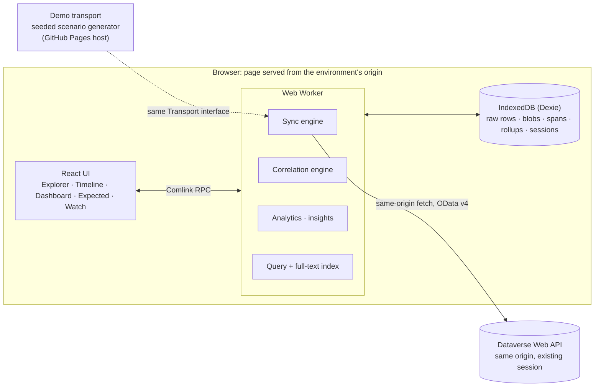

# Architecture

## 1. Shape of the system

A static single-page app with **no server of its own and no app registration**. One React bundle is built for two hosts:

- **In-environment host (real data):** the bundle ships as HTML/JS **web resources** in a managed Dataverse solution. The page is served from the environment's own origin (`https://<org>.crm*.dynamics.com/WebResources/dvt_/…`) and runs in the Dataverse web app's security context. Web API calls are same-origin `fetch('/api/data/v9.2/…')` using the user's existing session. The app never handles tokens.
- **Demo host (no data access):** the same bundle on GitHub Pages, with only the demo transport and session-file import turned on.

Everything the app collects stays in the browser's IndexedDB. Demo mode swaps the network transport for an in-browser generator, so the same code path runs without Dataverse.



The main thread only renders. All fetching, parsing, correlation, aggregation and searching run in one worker, so the UI stays responsive with 100k rows. The worker is loaded from a sibling JS web resource (same origin), so its requests carry the session cookie like the page's do. Spike S6 confirms this.

**Host abstraction.** A small `HostContext` tells the app where it runs: `inEnvironment` (the org URL comes from `window.location`, with `Xrm.Utility.getGlobalContext().getClientUrl()` used when available), `demo`, or `xrmToolBox` (P3). The `Transport` implementation is chosen from it. An optional MSAL-based `standalone` host could be added later without touching `core`.

## 2. Packages and modules

| Package | Responsibility | Depends on |
|---|---|---|
| `packages/core` | **Pure TypeScript domain logic, no DOM and no network.** The span model and types; correlation rules and confidence scoring; trace assembly; analytics (histograms, percentiles, rollups); the insight rules; the expected-vs-actual evaluator; an evaluator for the subset of OData `$filter` that flow triggers use; the .NET exception and stack-trace parser; the `#dvt` helper-header parser; the session file schema (zod); the OTLP mapper; redaction. | nothing |
| `packages/dataverse` | The `Transport` interface and its same-origin HTTP implementation (fetch with the session, paging through `@odata.nextLink`, handling 429 and `Retry-After`, a concurrency limit, abort). Query builders for each source. Row mappers from raw OData JSON to typed records. The capability probe. The sync engine (watermarks, coverage, scheduling, Web Locks). | core |
| `packages/store` | The Dexie schema, migrations, repositories, retention and pruning, the storage meter. Tested with `fake-indexeddb`. | core |
| `packages/demo` | The scenario generator (fixed seed) and a `MockTransport` that answers the same OData queries `packages/dataverse` sends, from generated rows. It also provides simulated watch-mode streaming. | core, dataverse (interfaces only) |
| `apps/web` | The React UI, routing, host detection, the worker entry point and Comlink bindings, charts, the waterfall, the graph. | all of the above |
| `apps/docs` | The documentation site. | — |
| `dotnet/DataverseTrace.PluginHelper` (P2) | The source-only NuGet package for plugins. | — |

Rule: `core` has **no** dependency on React, Dexie or fetch. That's what makes the correlation logic testable, reusable (for example in a future XrmToolBox or desktop shell) and worth showing in a portfolio.

## 3. Data sources and how each is read

| Source | Query shape (Web API) | Sync strategy |
|---|---|---|
| `plugintracelogs` metadata | `$select` = every column except `messageblock`, `configuration` and `secureconfiguration`; `$filter=createdon ge {wm}`; `$orderby=createdon asc,plugintracelogid asc`; `Prefer: odata.maxpagesize=2000` | Incremental on `createdon`. Duplicates are dropped by ID, because `createdon` may only have whole-second precision (S1). |
| `plugintracelogs` blobs | `$select=plugintracelogid,messageblock` over the same time window; page size 200 | A background lane behind the metadata lane, so the grid appears quickly. Blobs are gzipped (`CompressionStream`) before storing. Skipped entirely when the probe finds that trace text isn't readable. |
| `asyncoperations` | `$filter=modifiedon ge {wm} and operationtype in (1,10,54)`, with the columns listed in research §1 | Incremental on `modifiedon`, because jobs change state after they're created. Upsert by ID. |
| `flowruns` | `$filter=modifiedon ge {wm}`; flat `$select` (elastic table: no related-table filters) | Incremental. Aggregation happens on the client. |
| `flowevents` | `$filter=eventtype eq 'FlowRunIngestion' and createdon ge {wm}` | Incremental. Feeds the gap signals. |
| `audits` | `$filter=_objectid_value eq {id}` or a time window plus `objecttypecode`; details through `RetrieveAuditDetails` | **On demand only** (record timeline, watch mode) because audit volume is large. P2: optional bulk sync for tables the user picks. |
| Registrations: `sdkmessageprocessingsteps` (+ `$expand` message, filter, plugin type, images), `workflows` (category 0/2/5; `clientdata` for category 5), `callbackregistrations`, `organization` settings | Full snapshot | Refreshed on connect and then hourly, or on demand. A snapshot is versioned only when `modifiedon` changes, so a trace can be explained against the registration as it was **when the trace ran** (P2). |
| `plugintypestatistics` | Full snapshot, at most every 15 min | A version is stored each time Dataverse updates a row (`modifiedon`), to build trends and to answer S8. |

## 4. Local data model (IndexedDB via Dexie)

```
environments      id, url, orgId, displayName, lastConnectedAt, capabilities{…}
syncState         [envId+source], watermark, lastRunAt, lastOkAt, coverage: Interval[]
traceLogs         id, envId, correlationId, requestId, stepId, typeName, message, table,
                  mode, opType, depth, start, durationMs, ctorMs, createdOn, hasError,
                  errorHead, blobState(none|pending|stored|unreadable), blobSize
                  idx: [envId+createdOn], [envId+correlationId], [envId+stepId], [envId+typeName]
blobs             id(traceLogId), kind(message|exception), gz: Blob
asyncOps          id, envId, correlationId, requestId, regarding{table,id}, stepId, workflowId,
                  opType, state, status, created, started, completed, retryCount, error…
flowRuns          id, envId, workflowId, parentRunId, start, end, status, triggerType, error…
audits            id, envId, record{table,id}, operation, action, userId, transactionId, createdOn,
                  changedColumns[]
registrations     [envId+kind+id], version, validFrom, data (step | image | workflow | callback)
rollupsHourly     [stepKey@hour], count, errors, sumMs, maxMs, hist (sparse), ctor count/sum/hist, maxDepth, textKnown, truncated
statSnapshots     [statId@modifiedOn], counts… of one plugintypestatistic version, takenAt (store table: pluginStats)
spans             derived, can be rebuilt; cache of assembled traces keyed by traceKey
sessions          id, envId, kind(watch|capture|imported), createdAt, file(.dvtrace JSON)
savedViews, settings, pendingRestore(trace-setting marker)
```

- **Raw rows are the source of truth, and spans are derived.** When the correlation rules improve, the derived spans are rebuilt from raw rows, with no re-fetching.
- **Rollups** make dashboards over months fast, and they outlive the raw-row retention period.
- **Retention defaults:** raw rows 30 days, blobs 14 days, rollups 400 days, sessions kept until deleted. The app calls `navigator.storage.persist()` and shows a storage meter. "Forget this environment" wipes everything for that environment.

## 5. Sync engine

- **Scheduling:** catch-up on connect, then every 5 minutes while any tab is open (visible or not), plus polling every 2 seconds during watch mode and every 5 seconds during live tail.
- **One tab syncs at a time:** `navigator.locks.request('dvt-sync:'+envId)`. Other tabs get updates through `BroadcastChannel`.
- **Budget:** background sync stays under about 300 requests per 5 minutes (5 % of the documented limit), with at most 4 concurrent requests. On `429` every source for that environment pauses for `Retry-After`, and the status chip explains the pause.
- **Coverage:** each successful pull records the interval it covered. If more than 24 hours passed since the last successful trace-log pull, the gap `[lastOk, now − 24h]` is marked *possibly incomplete*, because the platform's bulk delete may already have removed rows. Charts shade these gaps.
- **Resumable:** the watermark only advances after a page has been saved. An aborted catch-up continues where it stopped.

## 6. The span model

Every source is normalised into one shape. The timeline, the dashboard, the exports and the correlation rules all work on spans.

```ts
type SpanKind =
  | 'request'            // synthetic: one message pipeline (same correlationId + requestId)
  | 'plugin'             // plugintracelog, operationtype = Plug-in
  | 'workflowActivity'   // plugintracelog, operationtype = Workflow Activity
  | 'systemJob'          // asyncoperation
  | 'flowRun'            // flowrun
  | 'audit'              // audit (instant event)
  | 'expected'           // ghost: registered but not (yet) seen
  | 'mark';              // sub-span from the #dvt helper header

interface Span {
  id: string;                         // `${sourceTable}:${sourceId}` (synthetic ids are stable hashes)
  traceKey: string;                   // correlationId, or `record:${table}:${id}:${t0}` for record traces
  kind: SpanKind;
  name: string;                       // "Harbor.Plugins.PolicyPostCreate" | "Update account" | flow name
  source: { table: string; id: string };
  start: number;                      // epoch ms, UTC
  end?: number;                       // undefined while running
  queuedAt?: number;                  // system jobs: createdon
  precision: 'ms' | 's';              // from spike S1; drives the UI indicator and link tolerances
  status: 'ok' | 'error' | 'running' | 'waiting' | 'canceled' | 'expected' | 'notFired';
  depth?: number;
  mode?: 'sync' | 'async';
  stage?: 10 | 20 | 30 | 40;
  rank?: number;
  message?: string;                   // Create | Update | …
  table?: string;
  record?: { table: string; id: string; exact: boolean };
  correlationId?: string;
  requestId?: string;
  stepId?: string;
  workflowId?: string;
  metrics: { durationMs?: number; ctorMs?: number; queueMs?: number; retries?: number };
  error?: { code?: string; message: string; exceptionType?: string };
  attrs: Record<string, string | number | boolean>;   // namespaced: dataverse.*, flow.*, audit.*
}

interface SpanLink {
  from: string;                       // parent / cause
  to: string;                         // child / effect
  type: 'childOf' | 'followsFrom' | 'triggeredBy' | 'sameRecord' | 'sameTransaction';
  confidence: number;                 // 1.0 = exact
  rule: string;                       // "R1" …
  evidence: { label: string; weight: number }[];
}

interface Trace {
  key: string;
  anchor?: { table: string; id: string; exact: boolean };
  spans: Span[];
  links: SpanLink[];
  caveats: Caveat[];                  // tracing off, blob unreadable, flow data incomplete, sync gap…
  summary: { wallMs: number; txMs?: number; errors: number; maxDepth: number; counts: Record<SpanKind, number> };
}
```

The model maps cleanly onto OpenTelemetry: `traceKey` becomes the trace ID, `childOf` becomes the parent span ID, other links become span links, and `attrs` become attributes. That's what makes the OTLP export (P2) a straightforward mapping.

## 7. Correlation rules

Rules are **pure functions** in `core`. Each one outputs links with a confidence and its evidence. There are two groups: **exact** rules (confidence 1.0, or close to it when timestamps are fuzzy) and **inferred** rules (scored).

### Exact and structural rules

| # | Rule | Link |
|---|---|---|
| R1 | Same `correlationid` across `plugintracelog` and `asyncoperation`. | Same trace. |
| R2 | Same `correlationid` + `requestid` → group under a synthetic **request** span (`<message> <table>`). Children are ordered by stage, then rank, then start time. | `childOf` request |
| R3 | Nesting: a request at depth d+1 is the child of a depth-d plugin span in the same correlation that **can contain it**: the parent's duration covers the request's work (the sum of its steps' durations, since they run one after another), and, allowing for starts truncated to the second, there's a placement where the request starts after the parent and finishes before it. Among feasible parents, the one with the **least slack** wins. With one candidate the link is exact; with several, confidence = 1 / number of candidates, and a caveat is shown. `createdon` order is deliberately not used, because when the platform writes trace rows isn't documented. **Measured on the demo's ground truth** (9,625 nested requests, 5 seeds, synthetic data): all 8,880 links shown as exact were correct, 92 % of links were exact, and 96 % of all picks were correct; the rest are flagged as ambiguous. | `childOf` |
| R4 | `asyncoperation.owningextensionid` = `plugintracelog.pluginstepid`, same correlation, trace start within `[startedon, completedon]`. Custom workflow activities have no step: they're matched to a workflow job (operation type 10) in the same correlation whose window contains them. | system job is the parent of the async trace row |
| R5 | `asyncoperation.regardingobjectid` gives the trace's **record anchor** (exact). The anchor comes from the lowest-depth job whose regarding table equals the depth-1 request's table. Jobs regarding other records are labelled "related record". | `sameRecord` |
| R6 | `flowrun.parentrunid` → parent flow run. | `childOf` |
| R7 | The same `audit.transactionid` groups audit events into one transaction. | `sameTransaction` |
| R8 | A `#dvt` helper header in `messageblock` → the exact record, the changed columns and sub-span marks. | anchor + `mark` children |
| R9 | `asyncoperation.workflowactivationid` → classic workflow job, linked to its `workflow` registration. | registration context |

### Inferred rules (scored)

**I1: a record save causes a sync-only correlation** (used when R5/R8 don't apply).
Candidates are correlations whose depth-1 request has `table` = the record's table and `message` matching the audit `operation`, and whose time window contains the audit's `createdon` (which has ms precision) ± tolerance. Evidence: time containment (+0.45), message match (+0.15), user match with `createdby` (+0.2, once S2 confirms what that column means), and uniqueness (+0.2 if there's only one candidate; otherwise a penalty that grows with the number of competitors).

**I2: a record save triggers a flow run.**
1. *Candidates (hard filters):* the flow's trigger (from `clientdata`, cross-checked with `callbackregistration`) matches the table and change type; the flow was on at the time; the run's `starttime` is in `[commit − 2 s, commit + window]` (default window 5 min, configurable); the trigger type is Automated.
2. *Scoring (additive, each item shown as evidence):*
   - trigger table and message match: **+0.15**
   - filtering columns overlap the changed columns: **+0.25**. If the trigger has no filtering columns (it fires on any change): **+0.10**. If there's no overlap, **drop the candidate**.
   - filter expression evaluates to true against the record: **+0.20**. If it can't be evaluated: **+0**, with a warning. If it evaluates to false, **drop the candidate**.
   - time proximity: **+0.30 × e^(−Δt/20 s)**
   - run-as and owner consistent with the triggering user: **+0.10** (P2)
3. *Assignment:* runs of one flow and matching saves in the same window are paired **one-to-one** (greedy, highest score first), so a single run can't be claimed by three saves.
4. *Ambiguity penalty:* confidence = score × clamp((best − second-best) / best, 0.3, 1).
5. *Buckets:* **High ≥ 0.8** (dashed line, shown), **Medium 0.5–0.8** (dashed, shown), **Low < 0.5** (hidden unless the user turns on "show low-confidence links").

**I3: a flow run causes downstream Dataverse operations** (P2, only if spike S9 shows no exact identity is available). Correlations whose depth-1 request starts inside a flow run's window, on a table the flow's actions write to (parsed from `clientdata`). Off by default.

**As built in v0.2** (engineering §8 lists the differences): I1 and I2 use the weights above. Saves **of the same record** and runs are paired one-to-one, best score first. Saves of other records are known only through their plug-in operations (a record story reads one record's audit), so instead of pairing, a run is discounted by its share of those saves shortly before it. A flow whose trigger has no matching live `callbackregistration` is marked "can't tell", with the reason. Low-confidence links are shown with their percentage rather than hidden, and inferred links are capped at **95 %**, so strong evidence never makes one look exact. (On demo data, 1–2.5 % of saves that ran no plug-ins were matched by timing to someone else's operation; before the cap, a few of those showed 100 %.) Measured against the demo generator's ground truth (every flow run knows which save triggered it; 14 days, the first 1,500 records): links at **0.8 or more were 567/567 correct, 0.5 to 0.8 were 1,887/1,887, and under 0.5 were 412/512 (80 %)**. The demo's delays are synthetic, so these numbers show the rules behave sensibly, not how they'll do in a real environment. A test keeps them from regressing (`packages/demo/src/generator.test.ts`).

**Calibration.** The weights above are starting values. Environments that use the NuGet helper (R8) produce **ground-truth** record links, so a labelled fixture set can be captured there and the inferred rules measured against it for precision and recall at each confidence bucket. The numbers are published in the docs. Honest calibration is part of the pitch.

### Assembling a trace

- **By correlation ID:** R1, R2, R3, R4, R5, R8 and R9 give one trace.
- **By record save:** start from the anchor (an audit event, an exact R5/R8 anchor, or the watch-mode start time). Gather correlations through R5, R8 and I1, flows through I2 and child flows through R6, audit events through R7. Merge everything into one `Trace` with `traceKey = record:…`.
- **Rules must hold (checked by property tests):** parent links contain no cycles; the result is the same whatever order the input rows arrive in; every inferred link has at least one evidence item; exact child spans lie inside their parent's time range within the precision tolerance.

## 8. Analytics

- **Percentiles** come from mergeable log-scale histograms: 64 buckets from 1 ms to about 20 min, each ≈ 1.25× the previous. They're stored per step per hour in `rollupsHourly`, so p50 and p95 over any range cost a few hundred merges, not a sort of 100k values. Within a single session (the explorer's current filter), exact percentiles are computed in the worker.
- **Heatmaps and trends** read from the rollups. Coverage intervals come from `syncState`.
- **Insights** are pure functions `(rollups, registrations, traces, settings) → Insight[]`, each with its evidence and a link that opens the matching filter.

## 9. Demo mode

- `packages/demo` builds a consistent fake environment from a **fixed seed**: registrations (assemblies, steps, images, workflows, flows with `clientdata`, callback registrations), then about two weeks of activity from a **scenario script**: a daily load curve, a lunch dip, a weekly pattern, and the scripted incidents listed in [features §11](features.md#11-demo-mode-p0).
- `MockTransport` implements the **subset of OData that `packages/dataverse` actually sends** (`$select`, `$filter` with `ge`/`eq`/`and`/`in`, `$orderby`, `$expand` for registrations, paging with `@odata.nextLink`), and can simulate delay, 429s and missing privileges. So demo mode exercises the real sync engine, capability probe and mappers.
- The same generator provides **fixtures for unit and E2E tests** and the scripted flow used to **record the README GIF** automatically.

## 10. Performance strategy

| Concern | Approach |
|---|---|
| Grid over 100k+ rows | TanStack Virtual. The worker keeps a **columnar in-memory index** (typed arrays for numbers, dictionary-encoded strings) and returns row windows by index. Target: filter or sort 100k rows in under 100 ms. |
| Full-text search over trace text | MiniSearch index built in the worker, in chunks and lazily (the first search triggers it), capped by memory. Falls back to a streaming substring scan over gzipped blobs. |
| Large payloads | Blobs are fetched and stored separately, gzipped, and never loaded into the grid. |
| Charts | ECharts on canvas. Dashboards read the rollups, never raw rows. |
| Waterfall | SVG, virtualised by row. Traces over 2,000 spans collapse by depth and group identical repeated spans ("AccountRollup ×340"). |
| Bundle | Route-level code splitting. The explorer shell stays under about 250 KB gzipped; charts, CodeMirror and React Flow load on demand. Checked in CI with `size-limit`. |

## 11. Security architecture

- **No server, no proxy, no tokens.** In the environment, all traffic is same-origin to the Dataverse Web API under the user's own session and privileges. The app never sees credentials or tokens. The demo site makes no network calls apart from loading its own files. There's no telemetry.
- **Same-origin caveat:** IndexedDB on the environment's origin can be read by any other script served from that origin (other web resources, form scripts). That's the same trust boundary as the environment itself, and the data-handling docs state it.
- **Content-Security-Policy:** the demo site sets a `<meta>` CSP (`default-src 'self'; script-src 'self'; connect-src 'self'; object-src 'none'; base-uri 'none'; form-action 'none'`). Inside the environment, the platform's own CSP settings apply. The bundle avoids `eval` and inline scripts, so it works under strict policies. Griffel's build-time CSS extraction avoids needing inline styles.
- **Untrusted content:** trace text, exception text, flow error messages and imported files are always shown **as text** (CodeMirror, React text nodes) and never as HTML. Imported `.dvtrace.json` files are checked against the zod schema and a size cap.
- **Data at rest:** IndexedDB isn't encrypted. The docs say so plainly, and the app offers retention settings, "Forget environment" and redaction on export. (P3: optional encryption with WebCrypto and a passphrase.)
- **Least privilege:** the app never requests or needs write privileges, except `organization` update for the optional trace-setting switch, which is only offered to System Administrators and always asks first.
- **Supply chain:** a lockfile, Dependabot, CodeQL, `npm audit` in CI, few runtime dependencies, and all assets served from the app's own origin (no CDNs).
